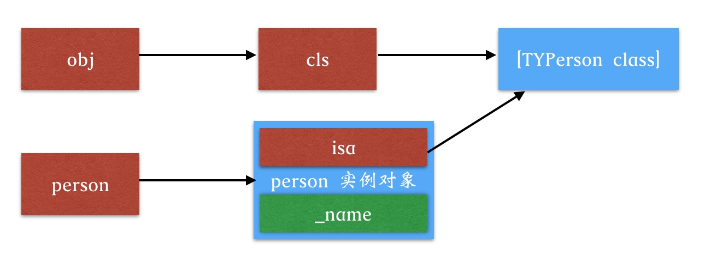

# README

有这么个面试题: 

看如下代码,打印结果是什么?

```objc
- (void)viewDidLoad {
    [super viewDidLoad];
    
    id cls = [TYPerson class];
    
    void *obj = &cls;
    
    [(__bridge id)obj log];
}
```

这段代码的前提是有这么一个类: `TYPerson`

```objc
// TYPerson.h
@interface TYPerson : NSObject

@property (nonatomic, copy) NSString *name;

- (void)log;

@end

// TYPerson.m
@implementation TYPerson

- (void)log {
    NSLog(@"My name is -%@",self.name);
}

@end
```

运行程序,看打印结果:

```c
superDemo[14423:913664] My name is -<ViewController: 0x7f8066e0ea50>
```

重新看`viewDidLoad`里的代码,应该会有几个疑问?

- `log 方法`, 明明是 TYPerson 里的方法,为什么上面没有通过 TYPerson 的实例对象去调用,就可以执行`log`方法呢?
- 为什么打印结果的`self.name`变成了`<ViewController: 0x7f8066e0ea50>`

带着这两个疑问,看下其如何实现的.

首先看一个比较熟悉的. 下面这么写应该都懂.

```objc
TYPerson *person = [[TYPerson alloc] init];
[person log];
``` 

- 这里左边的 `*person` 是指向的存储着 `TYPerson`对象的地址的`指针`.所以其指向的是`TYPerson 的实例对象`.
- 然后一个实例对象,其在内存中存放的有
    - isa 指针
    - 及其自己的成员变量.
    - 在这里就是 `isa` 和 `_name`.
- `isa` 指向的是 `[TYPerson class]`这个类对象.

这时分析 `viewDidLoad`里的代码:

- `id cls = [TYPerson class];`
    - `cls`  就是一个指向 `[TYPerson class]`内存地址的指针.
- `void *obj = &cls;`
    - 而 `*obj` 是指向 `cls` 地址的指针.

上面两个用图表示如下:


 
从上图可以侧面说明, `obj` 为什么可以调用 `log` 方法.

- 因为`person` 指向的内存的前8个字节就是`isa`指针,然后通过`isa`去类对象中找方法,然后调用.
- 一样的结构, `obj`也是在指向的内存中取出前8个字节,就是`cls`.应该是和 isa 一样的,然后去找类对象中的方法,从而调用.

#### 至于打印的东西

```objc
- (void)viewDidLoad {
    [super viewDidLoad];
    
    NSString *name = @"mty";
    
    id cls = [TYPerson class];
    
    void *obj = &cls;
    
    [(__bridge id)obj log]
}
```

如上这么写, 打印结果就是 :

```c
My name is -mty
```

那么为什么会打印出这个呢? `name`明明是`TYPerson` 的属性啊.

首先看下如下分析过程:

##### 栈空间的内存分配

首先看下如下函数:

```objc
- (void)test {
    int a = 40;     
    int b = 100;    
    int c = 300;
    NSLog(@"%p--%p--%p",&a,&b,&c);
}
```

打印后,这3个局部变量在内存中的地址是:

```c
0x7ffee7e7e9ec--0x7ffee7e7e9e8--0x7ffee7e7e9e4
```

可以看出:

- 变量`a`在内存中地址最高,其次`b`,最后`c`,且内存地址是连续的.
- 因为局部变量是分配在栈空间的,而栈空间的内存分配,从高地址到低地址的

知道了栈空间的内存分配,回到`viewDidLoad`方法来看.可以推断出`name`,`cls`,`obj`在内存中的分配同上面的函数类似.

- 肯定是`name`在高地址.其次是`cls`,最后是`obj`


为什么会打印出 `my name is -mty`.看如下方法:

```objc
- (void)log {
    NSLog(@"My name is -%@",self.name);
}
```

- `self.name`的本质就是通过`self`去拿`_name`.即`self->_name`.
- 那么这里的`self`就是`obj`.(`self` 是方法调用者)

`TYPerson` 的底层结构:

```c++
struct TYPerson_IMPL {
    Class isa;
    NSString *_name;
}
```

- 所以通过`self指针`拿`_name`,其本质就是通过`self 指针`找到`TYPerson_IMPL`这块存储空间,然后`忽略前面的8个字节`(`isa`),开始找.取出来就是`_name`.

所以上面的就相当于 `obj` 找到`cls`这块存储空间,`cls`这里其实就相当于`isa`,所以找的时候,忽略这8个字节,找到了`name`.所以打印出来的就是 `my name is -mty`.

如果将`viewDidLoad`中的代码改为如下这样呢?

```objc
- (void)viewDidLoad {
    [super viewDidLoad];
    
    
    NSString *name = @"mty";
    NSObject *obj2 = [[NSObject alloc] init];
    
    id cls = [TYPerson class];
    
    void *obj = &cls;
    
    [(__bridge id)obj log];
}
```

打印结果为:

```c
My name is -<NSObject: 0x6000025332d0>
```

原理类似,这里画图说明一下:


所以,同理,当`obj`即`self`去找`_name`时,就会先忽略`cls`(相当于 `isa`指针),找其最近的,即`obj2`.所以打印就是 `My name is -<NSObject: 0x6000025332d0>`.

##### 为什么打印的是控制器?

当`viewDidLoad`中的代码是下面这种时,打印的就是控制器.

```objc
- (void)viewDidLoad {
    [super viewDidLoad];
   
//    NSString *name = @"mty";
//    NSObject *obj2 = [[NSObject alloc] init];
    
    id cls = [TYPerson class];
    
    void *obj = &cls;
    
    [(__bridge id)obj log];

}
```

打印结果:

```c
My name is -<ViewController: 0x7fd761c143c0>
```

其根本原因就是`[super viewDidLoad]`这句.将其编译成`c++`代码可以看到:

```c++
static void _I_ViewController_viewDidLoad(ViewController * self, SEL _cmd) {

    ((void (*)(__rw_objc_super *, SEL))(void *)objc_msgSendSuper)((__rw_objc_super){(id)self, (id)class_getSuperclass(objc_getClass("ViewController"))}, sel_registerName("viewDidLoad"));

    id cls = ((Class (*)(id, SEL))(void *)objc_msgSend)((id)objc_getClass("TYPerson"), sel_registerName("class"));

    void *obj = &cls;

    ((void (*)(id, SEL))(void *)objc_msgSend)((id)obj, sel_registerName("log"));

    ((void (*)(id, SEL))(void *)objc_msgSend)((id)self, sel_registerName("test"));

}
```

`[super viewDidLoad]` 对应

```c++
 ((void (*)(__rw_objc_super *, SEL))(void *)objc_msgSendSuper)((__rw_objc_super){(id)self, (id)class_getSuperclass(objc_getClass("ViewController"))}, sel_registerName("viewDidLoad"));
 
 // 简化如下:
 // 结构体:
 struct _rw_objc_super = {
    self,
    class_getSuperclass(objc_getClass("ViewController"))
 };
objc_msgSendSuper(_rw_objc_super, sel_registerName("viewDidLoad"));
```

所以用下图表示就是:


- 所以,略过`cls`,拿到结构体中的`self`,而`self`指向的是控制器`UIViewController`,所以打印结果可知.


